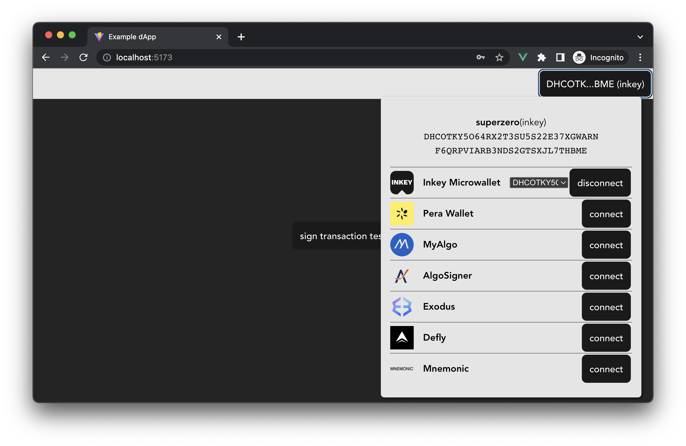

> ⚠️ **this is beta software**: no significant security audits have yet been performed so use at your own discretion.

# any-wallet
is a wallet connection handler for web3 dapps

## about
any-wallet provides a common interface layer between the dapp and the wallet so dapp developers can treat any connected wallet the same way. any-wallet does not load a wallet's client library until it needs to or the user starts interacting with that wallet. for optimal user experience across page loads, any-wallet saves the last connected account to localstorage (dont worry, no secrets are saved, just the user's public address and a reference to which wallet they connected with).

we currently support these chains + wallets:
- algorand
	- pera
	- inkey
	- myalgo
	- algosigner
	- exodus
	- defly
	- mnemonic input (not "safe" but helpful for development)

## using the mnemonic wallet
this wallet can be connected via a mnemonic passed into the init params OR via html prompt input.
1. mnemonic via prompt input
...

2. mnemonic via code config
...

## Notes
- some wallets (like defly/pera) require that the mobile app is set to the same net (testnet/mainnet) as requested for signing by the dapp
- using mnemonic wallet
	-

## TODO
- Q: try mnemonic connect, reload, then try to sign txn. cant because its lost the mnemonic from the input. should we store the mnemonic in ls or what?
- known err: if defly was connected, page reloads, then try test txn on Demo.vue page. lib has err constructing. but signing IS ok if connected + signed in same flow w/out reload
-

## Attributions

big thanks to txnlab/use-wallet for developing the react groundwork for this pkg
